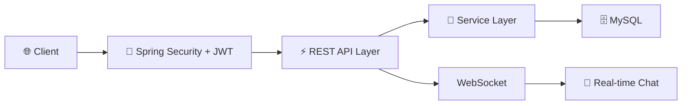

<div align="center">

# 👟 ShoeVerse

### *Nơi Mỗi Bước Chân Kể Một Câu Chuyện*


---

### 🚀 Công Nghệ Sử Dụng


[](LICENSE)
[](http://makeapullrequest.com)

[🎬 Demo Trực Tiếp](https://shoeverse-demo.com) • [📖 Tài Liệu](https://docs.shoeverse.com) • [🐛 Báo Lỗi](https://github.com/yourusername/shoeverse/issues) • [✨ Yêu Cầu Tính Năng](https://github.com/yourusername/shoeverse/issues)

</div>

---

## 🌟 Tổng Quan

**ShoeVerse** là một **nền tảng thương mại xã hội full-stack** tiên tiến, cách mạng hóa việc mua sắm giày trực tuyến bằng cách kết hợp chức năng thương mại điện tử liền mạch với tương tác xã hội thời gian thực và tích hợp thanh toán bảo mật. Được xây dựng với kiến trúc cấp doanh nghiệp và công nghệ hiện đại, nền tảng mang lại hiệu suất, khả năng mở rộng và trải nghiệm người dùng vượt trội.

> 💡 **Hoàn hảo cho**: Doanh nghiệp thương mại điện tử, startup, dự án portfolio, và học tập phát triển full-stack nâng cao

---

## ✨ Tính Năng Chính

<table>
<tr>
<td width="50%">

### 🛍️ Lõi Thương Mại Điện Tử
- 📦 **Danh Mục Sản Phẩm** với bộ lọc theo danh mục, màu sắc, kích cỡ
- 🛒 **Giỏ Hàng** với quản lý sản phẩm
- 📊 **Quản Lý Đơn Hàng** theo trạng thái
- � **Quản Lý Tài Khoản** cá nhân và địa chỉ
- 🔐 **Xác Thực & Phân Quyền** (User/Admin)

</td>
<td width="50%">

### 💬 Tính Năng Xã Hội
- ⭐ **Hệ Thống Đánh Giá & Bình Luận** sản phẩm
- 💬 **Chat Thời Gian Thực** (WebSocket)
- � **Đăng Bài & Tương Tác** trên mạng xã hội
- 👥 **Theo Dõi & Kết Bạn**
- 🖼️ **Chia Sẻ Hình Ảnh**

</td>
</tr>
</table>

---

## 🎯 Điểm Nổi Bật



<div align="center">

| Tính Năng | Công Nghệ | Trạng Thái |
|---------|-----------|-----------|
| 🔐 **Xác Thực** | JWT + Spring Security | ✅ Hoạt Động |
| 💬 **Chat Thời Gian Thực** | WebSocket (STOMP) | ✅ Hoạt Động |
| � **Mạng Xã Hội** | Posts, Comments, Likes | ✅ Hoạt Động |
| �️ **Database** | MySQL 8.0 | ✅ Hoạt Động |

</div>

---
## 🚀 Bắt Đầu Nhanh

### Yêu Cầu Hệ Thống

```bash
Java 21
Node.js 18+
MySQL 8.0+
Maven 3.x
```

### 💻 Cài Đặt Thủ Công

git clone https://github.com/Vivuatroidanh/Social-Commerce-Platform.git

<details>
<summary><b>Nhấp để xem các bước cài đặt thủ công</b></summary>

#### Cài Đặt Backend

```bash
cd shoe-shop

# Cấu hình database (application.yml)
spring:
  datasource:
    url: jdbc:mysql://localhost:3306/Bitis
    username: tên_người_dùng_của_bạn
    password: mật_khẩu_của_bạn

# Chạy ứng dụng
./mvnw spring-boot:run
```

#### Cài Đặt Frontend

```bash
cd bitis-frontend

# Cài đặt dependencies
npm install

# Cấu hình API endpoint (.env)
VITE_API_URL=http://localhost:5173

# Khởi động development server
npm run dev
```

</details>

---

## 🔧 Chi Tiết Công Nghệ

### Backend 🎯

```yaml
Framework:       Spring Boot 4.0.1
Ngôn Ngữ:        Java 21
Bảo Mật:         Spring Security + JWT
Database:        MySQL 8.0
Thời Gian Thực:  WebSocket (STOMP)
Testing:         JUnit 5
Build Tool:      Maven
```

### Frontend 🎨

```yaml
Framework:       React 19
Build Tool:      Vite 7.x
Styling:         TailwindCSS 3.x
Quản Lý State:   Zustand + React Query
UI Components:   Lucide Icons
HTTP Client:     Axios
Routing:         React Router v7
```

### DevOps 🐳

```yaml
Quản Lý Phiên Bản: Git + GitHub
License:         MIT
```

---

## 🔐 Tính Năng Bảo Mật

- ✅ **Xác Thực JWT** với xoay vòng refresh token
- ✅ **HTTPS** sẵn sàng với hỗ trợ SSL/TLS
- ✅ **CORS** được cấu hình cho cross-origin requests
- ✅ **Phòng Chống SQL Injection** thông qua JPA
- ✅ **Bảo Vệ XSS** với HttpOnly cookies
- ✅ **Bảo Vệ CSRF** với SameSite cookies
- ✅ **Giới Hạn Tốc Độ** trên các endpoint xác thực
- ✅ **Kiểm Soát Truy Cập Dựa Trên Vai Trò** (RBAC)

---

## 📊 Kiến Trúc & Tối Ưu

| Tính Năng | Triển Khai |
|-------------|----------------|
| **Kiến Trúc Backend** | 3-Layer Architecture (Controller-Service-Repository) |
| **ORM** | Spring Data JPA với Hibernate |
| **API Design** | RESTful API |
| **State Management** | React Query cho server state, Zustand cho client state |
| **Routing** | React Router với lazy loading |

---

**Tính Năng Đã Triển Khai:**
- ✅ Xác thực JWT với HttpOnly Cookies
- ✅ Quản lý sản phẩm (CRUD)
- ✅ Giỏ hàng và đơn hàng
- ✅ Hệ thống mạng xã hội (posts, comments, likes)
- ✅ Chat thời gian thực

---

## 🤝 Đóng Góp

Đóng góp là điều làm cho cộng đồng mã nguồn mở trở nên tuyệt vời! Mọi đóng góp của bạn đều được **đánh giá cao**.

1. Fork Dự Án
2. Tạo Feature Branch của bạn (`git checkout -b feature/TinhNangTuyetVoi`)
3. Commit Thay Đổi của bạn (`git commit -m 'Thêm TinhNangTuyetVoi'`)
4. Push lên Branch (`git push origin feature/TinhNangTuyetVoi`)
5. Mở Pull Request

---

## 🗺️ Lộ Trình Phát Triển

- [ ] � Tích Hợp Cổng Thanh Toán (VNPay, MoMo)
- [ ] 📦 Hệ Thống Theo Dõi Vận Chuyển
- [ ] 🎁 Flash Sale & Voucher
- [ ] 📊 Dashboard Quản Trị Nâng Cao
- [ ] 🔔 Thông Báo Push Notifications
- [ ] 📧 Email Marketing
- [ ] 🐳 Docker Containerization
- [ ] � Progressive Web App (PWA)
- [ ] 🤖 AI Gợi Ý Sản Phẩm

---

## 📄 Giấy Phép

Phân phối theo Giấy phép MIT. Xem `LICENSE` để biết thêm thông tin.

---

## 👨‍💻 Tác Giả

**ToiTuLamHet**

[](https://github.com/ToiTuLamHet)
[](mailto:zzzNszzz19@gmail.com)

---

## ⭐ Ủng Hộ Dự Án

Cho một ⭐️ nếu dự án này giúp ích cho bạn!

---

<div align="center">

### 🙏 Lời Cảm Ơn

Được xây dựng với ❤️ sử dụng **Spring Boot** & **React**

Cảm ơn đặc biệt đến cộng đồng mã nguồn mở tuyệt vời

---

**[↑ Về Đầu Trang](#-shoeverse)**

</div>
