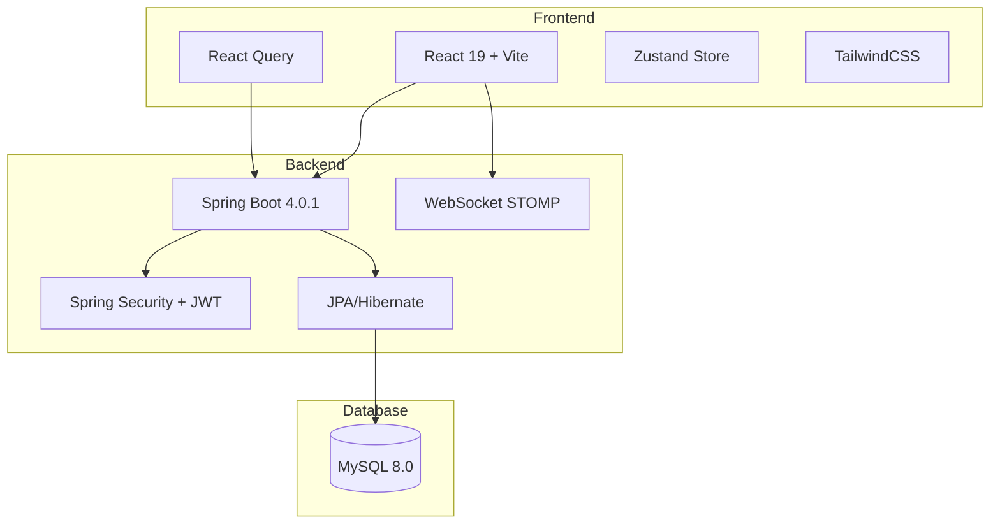

<div align="center">

# 👟 ShoeVerse - Nền Tảng Bán Giày Trực Tuyến

### *Kết Hợp Thương Mại Điện Tử & Chat Thời Gian Thực*


---

### 🚀 Công Nghệ Sử Dụng


[](LICENSE)
[](http://makeapullrequest.com)

</div>

---

## 🌟 Giới Thiệu

**ShoeVerse** là nền tảng thương mại điện tử bán giày được xây dựng với kiến trúc full-stack hiện đại. Dự án kết hợp chức năng mua sắm trực tuyến với tính năng chat thời gian thực, mang đến trải nghiệm mua sắm tương tác và tiện lợi.

### 🎯 Mục Đích Dự Án
- Học tập và thực hành phát triển ứng dụng full-stack
- Áp dụng kiến trúc 3 lớp (Controller-Service-Repository)
- Triển khai xác thực JWT với HttpOnly Cookies
- Tích hợp WebSocket cho chat thời gian thực

---

## ✨ Tính Năng Đã Triển Khai

### 🔐 Xác Thực & Phân Quyền
- ✅ Đăng ký và đăng nhập người dùng
- ✅ JWT Authentication với HttpOnly Cookies
- ✅ Phân quyền ADMIN/USER
- ✅ Protected Routes trên frontend

### 🛍️ Quản Lý Sản Phẩm
- ✅ Xem danh sách sản phẩm
- ✅ Xem chi tiết sản phẩm
- ✅ Tìm kiếm sản phẩm theo từ khóa
- ✅ Lọc sản phẩm theo danh mục
- ✅ CRUD sản phẩm (chỉ Admin)

### 🛒 Giỏ Hàng
- ✅ Thêm sản phẩm vào giỏ hàng
- ✅ Cập nhật số lượng sản phẩm
- ✅ Xóa sản phẩm khỏi giỏ hàng
- ✅ Xóa toàn bộ giỏ hàng
- ✅ Tính tổng tiền tự động

### 📦 Quản Lý Đơn Hàng
- ✅ Tạo đơn hàng từ giỏ hàng
- ✅ Xem lịch sử đơn hàng
- ✅ Xem chi tiết đơn hàng
- ✅ Cập nhật trạng thái đơn hàng (Admin)
- ✅ Hỗ trợ thanh toán COD và QR Code
- ✅ Theo dõi trạng thái: PENDING → PROCESSING → SHIPPING → DELIVERED

### 💬 Chat Thời Gian Thực
- ✅ Chat 1-1 giữa người dùng
- ✅ WebSocket (STOMP) cho real-time messaging
- ✅ Lịch sử tin nhắn
- ✅ Trạng thái đã đọc/chưa đọc

### 👨‍💼 Admin Dashboard
- ✅ Quản lý sản phẩm (thêm, sửa, xóa)
- ✅ Quản lý đơn hàng
- ✅ Cập nhật trạng thái đơn hàng

---

## �️ Kiến Trúc Hệ Thống



### Backend Architecture (3-Layer)

```
Controller Layer (REST API)
    ↓
Service Layer (Business Logic)
    ↓
Repository Layer (Data Access)
    ↓
Database (MySQL)
```

---

## 🔧 Chi Tiết Công Nghệ

### Backend 🎯

| Thành Phần | Công Nghệ | Mô Tả |
|-----------|-----------|-------|
| **Framework** | Spring Boot 4.0.1 | Framework chính |
| **Ngôn Ngữ** | Java 21 | JDK version |
| **Bảo Mật** | Spring Security + JWT | Xác thực & phân quyền |
| **Database** | MySQL 8.0 | Cơ sở dữ liệu quan hệ |
| **ORM** | Spring Data JPA + Hibernate | Object-Relational Mapping |
| **Real-time** | WebSocket (STOMP) | Chat thời gian thực |
| **Build Tool** | Maven | Quản lý dependencies |

**Entities:**
- `User` - Thông tin người dùng (username, email, role)
- `Product` - Sản phẩm (name, price, category, size, stock)
- `CartItem` - Sản phẩm trong giỏ hàng
- `Order` - Đơn hàng (totalAmount, status, paymentMethod)
- `OrderItem` - Chi tiết sản phẩm trong đơn hàng
- `ChatMessage` - Tin nhắn chat

**API Endpoints:**
- `/api/auth/*` - Đăng ký, đăng nhập, đăng xuất
- `/api/products/*` - CRUD sản phẩm, tìm kiếm, lọc
- `/api/cart/*` - Quản lý giỏ hàng
- `/api/orders/*` - Tạo và quản lý đơn hàng
- `/api/chat/*` - Lấy lịch sử chat
- `/ws/*` - WebSocket endpoint cho chat

### Frontend 🎨

| Thành Phần | Công Nghệ | Mô Tả |
|-----------|-----------|-------|
| **Framework** | React 19 | UI framework |
| **Build Tool** | Vite 7.x | Fast build tool |
| **Styling** | TailwindCSS 3.x | Utility-first CSS |
| **State Management** | Zustand | Client state (auth) |
| **Server State** | React Query (TanStack) | API data caching |
| **Routing** | React Router v7 | Client-side routing |
| **HTTP Client** | Axios | API requests |
| **Icons** | Lucide React | Icon library |

**Pages:**
- `Home` - Trang chủ
- `Products` - Danh sách sản phẩm
- `ProductDetail` - Chi tiết sản phẩm
- `Cart` - Giỏ hàng
- `Orders` - Lịch sử đơn hàng
- `Chat` - Chat thời gian thực
- `Admin/Dashboard` - Quản trị viên

---

## 🚀 Hướng Dẫn Cài Đặt

### Yêu Cầu Hệ Thống

```bash
Java 21
Node.js 18+
MySQL 8.0+
Maven 3.x
```

### 1️⃣ Clone Repository

```bash
git clone https://github.com/Vivuatroidanh/Social-Commerce-Platform.git
cd Social-Commerce-Platform
```

### 2️⃣ Cài Đặt Backend

```bash
cd shoe-shop

# Tạo database MySQL
mysql -u root -p
CREATE DATABASE Bitis;
exit;

# Cấu hình database trong application.properties
# File: src/main/resources/application.properties
spring.datasource.url=jdbc:mysql://localhost:3306/Bitis
spring.datasource.username=root
spring.datasource.password=your_password

# Chạy ứng dụng
./mvnw spring-boot:run
```

Backend sẽ chạy tại: `http://localhost:8080`

### 3️⃣ Cài Đặt Frontend

```bash
cd bitis-frontend

# Cài đặt dependencies
npm install

# Chạy development server
npm run dev
```

Frontend sẽ chạy tại: `http://localhost:5173`

---

## � Database Schema

### Bảng Chính

**users**
- id, username, password, full_name, email, phone, address, role, created_at, updated_at

**products**
- id, name, description, price, image_url, category, size, stock, created_at, updated_at

**cart_items**
- id, user_id, product_id, quantity, created_at

**orders**
- id, user_id, total_amount, payment_method, payment_status, delivery_address, delivery_phone, status, notes, created_at, updated_at

**order_items**
- id, order_id, product_id, quantity, price

**chat_messages**
- id, sender_id, receiver_id, message, is_read, created_at

---

## 🔐 Bảo Mật

- ✅ **JWT Authentication** với HttpOnly Cookies (chống XSS)
- ✅ **Password Encryption** với BCrypt
- ✅ **CORS Configuration** cho cross-origin requests
- ✅ **Role-Based Access Control** (ADMIN/USER)
- ✅ **SQL Injection Prevention** thông qua JPA
- ✅ **CSRF Protection** với SameSite cookies

---

## �️ Lộ Trình Phát Triển

### Đang Phát Triển 🚧
- [ ] Upload hình ảnh sản phẩm
- [ ] Đánh giá và bình luận sản phẩm
- [ ] Thông báo real-time

### Kế Hoạch Tương Lai 📋
- [ ] Tích hợp cổng thanh toán (VNPay, MoMo)
- [ ] Hệ thống voucher và khuyến mãi
- [ ] Theo dõi vận chuyển
- [ ] Dashboard analytics cho Admin
- [ ] Email notifications
- [ ] Docker containerization
- [ ] Progressive Web App (PWA)

---

## 🤝 Đóng Góp

Mọi đóng góp đều được chào đón! Vui lòng:

1. Fork dự án
2. Tạo feature branch (`git checkout -b feature/TinhNangMoi`)
3. Commit thay đổi (`git commit -m 'Thêm tính năng mới'`)
4. Push lên branch (`git push origin feature/TinhNangMoi`)
5. Tạo Pull Request

---

## � License

Dự án được phân phối theo giấy phép MIT. Xem file [LICENSE](LICENSE) để biết thêm chi tiết.

---

## 👨‍💻 Tác Giả

**ToiTuLamHet**

[](https://github.com/ToiTuLamHet)
[](mailto:zzzNszzz19@gmail.com)

---

## 🙏 Lời Cảm Ơn

Dự án được xây dựng với mục đích học tập và thực hành. Cảm ơn cộng đồng open-source đã cung cấp các công cụ tuyệt vời!

---

<div align="center">

**[⬆ Về Đầu Trang](#-shoeverse---nền-tảng-bán-giày-trực-tuyến)**

Made with ❤️ using Spring Boot & React

</div>
